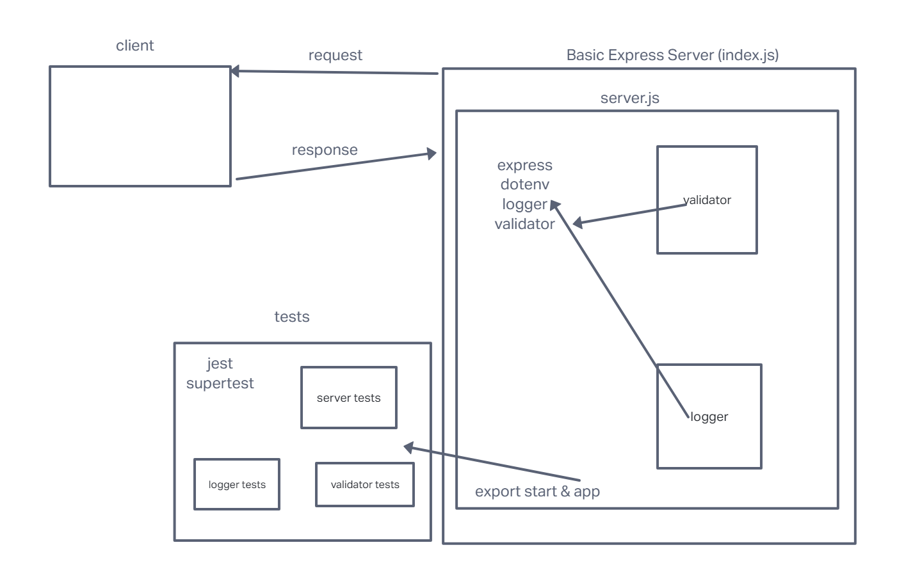

# LAB - Class 02

## Project: basic-express-server

### Author: Ike Steoger

### Problem Domain

This is a basic Express server using best practices, including server modularization, use of middleware, and tests.

### Links and Resources

- [GitHub Actions ci/cd](https://github.com/IkeSteoger/basic-express-server/actions)
<!-- - [back-end dev server url]() -->
- [back-end prod server url](https://basic-express-server-main.onrender.com)

### Collaborators

### Setup

#### `.env` requirements (where applicable)

Using only PORT which can be found on `.env.sample`

#### How to initialize/run your application (where applicable)

Clone repo, `npm i`, then run `nodemon` in the terminal

#### Routes

- GET : `/person` - specific route to hit

#### Tests

To run tests, after running `npm i`, run the command `npm test`

#### UML

